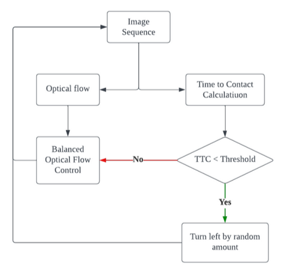

# Autonomous-Robot-Obstacle-Avoidance
## Overview
This project is a group project of ENPM673, focusing on utilizing optical flow information from a single camera to enable autonomous navigation in a complex environment while ensuring obstacle avoidance. Optical flow captures the movement of objects or features in the image resulting from the camera’s motion relative to the scene. Drawing inspiration from [Souhila and Karim’s work](http://journals.sagepub.com/doi/pdf/10.5772/5715), our strategy involves extracting optical flow, focus of expansion, time-to-contact, and depth map data to control the robot’s wheel velocity, which is similar to the idea of a Braitenberg vehicle. This approach enables the robot to effectively navigate and evade obstacles. Our project involves implementing this pipeline on a mobile robot platform powered by Raspberry Pi 3 and equipped with a Picamera 2. To assess the algorithm’s effectiveness, we conducted rigorous experiments using our physical robot, including navigation within an enclosed arena with obstacles placed, to evaluate its robustness and performance in real-world scenarios.

| | |
|:--:| :--:|
| *Object avoidance navigation system* | *Mobile Robot* |

## Demo

## References
1. Souhila, K., & Karim, A. (2007). Optical flow based robot obstacle avoidance. International Journal of Advanced Robotic Systems, 4(1), 2.